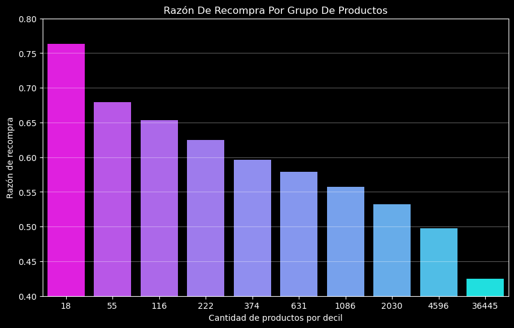
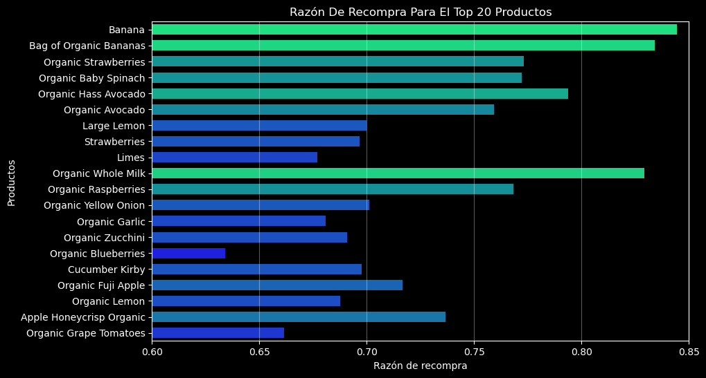
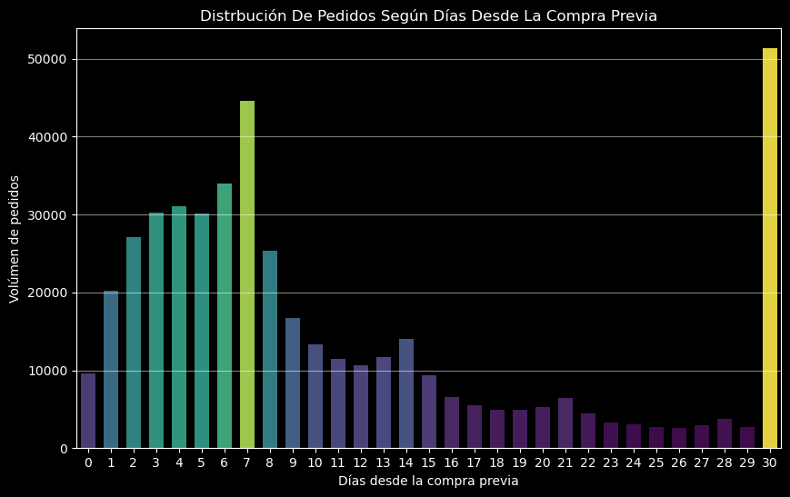
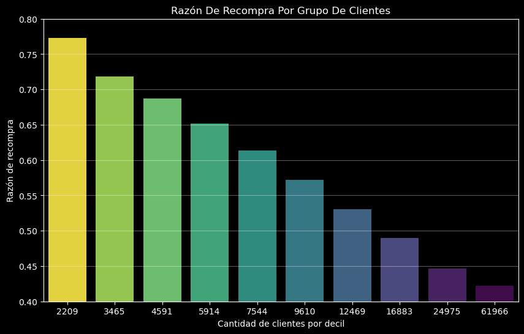

# 🛒 Instacart Market Basket Analysis: Intelligence & Customer Loyalty ⚙️

Este proyecto transforma un dataset masivo de transacciones de **Instacart** en inteligencia de negocio. A través de un Análisis Exploratorio de Datos (EDA) profundo, se identifican patrones de recompra, ventanas críticas de demanda y una segmentación estratégica de productos y clientes.

---

## 📊 Resumen Ejecutivo: Consumer Insights

* **⚡ El Motor del Catálogo (Efecto Pareto):** Se identificó una concentración extrema donde solo el **1.7% de los productos** genera el **50% del volumen total** de ventas.

  

* **🌿 La Ventaja Orgánica:** El segmento orgánico domina el Top 20 de ventas y presenta una tasa de recompra significativamente superior al promedio general.

  

* **⏰ Ciclos de Fidelidad Siete-Días:** Existe una "marea" semanal de demanda que alcanza su pico los **domingos y lunes**, con un ciclo de reposición exacto de **7 días**.

  

* **💎 Usuarios VIP:** Menos del **2% de los usuarios** mueven el **10% de las transacciones**, manteniendo una lealtad del **77%** en sus canastas básicas.

  

---

## 🛠️ Acceso al Proyecto

Explora el proceso técnico detrás de los datos y la herramienta interactiva final:

### 📊 [Dashboard Interactivo (Streamlit)](https://8lyyid3uaf6wn9a3cfxtev.streamlit.app/)
> **Ideal para:** Una exploración rápida y visual. Permite filtrar por día, hora y ver el comportamiento del catálogo con gráficas de Plotly.

### 📓 [Documentación Técnica (Jupyter Notebook)](https://github.com/DavidVaAc/instacart-market-basket-analysis/blob/main/notebooks/instacart_eda_analysis.ipynb)
> **Ideal para:** Revisar el rigor científico. Contiene la limpieza de datos, el procesamiento de tipos de variables y la lógica matemática detrás de los deciles de Pareto.

---

## 🔬 Metodología y Hallazgos Críticos

### 1. ✅ Auditoría y Calidad de Datos
Se implementó un protocolo de limpieza robusto para manejar anomalías del mundo real:
* **Tratamiento de Nulos:** Identificación de nulos funcionales (primeros pedidos) vs. errores de captura.
* **Eliminación de Duplicados:** Detección de errores sistémicos (duplicados concentrados en franjas horarias específicas).
* **Optimización de Tipos:** Reducción de carga en memoria para el procesamiento eficiente de $>400,000$ órdenes.

### 2. ⏳ Dinámicas Temporales y de Recompra
El análisis reveló una bimodalidad en la retención:
* Los usuarios tienden a comprar en bloques de **7**, sugiriendo hábitos de reabastecimiento semanal.
* **Insight:** Las campañas de *re-engagement* deberían activarse preventivamente en el **día 6** para capitalizar la inercia del hábito semanal.

### 3. 🎯 Segmentación por Deciles (Pareto Analysis) 
Utilizando un enfoque de deciles de volumen, se descubrió:
* **Decil 1 (Productos):** 18 productos estrella ($0.04\%$ del catálogo) son los responsables del primer $10\%$ de ingresos.
* **Decil 1 (Clientes):** Solo 2,209 usuarios ($1.48\%$ de la base) generan el $10\%$ del volumen, con una tasa de recompra del **$77.3\%$**.

---

## 🛠️ Tecnologías y Herramientas
* **Lenguaje:** Python 3.x
* **Análisis de Datos:** Pandas, NumPy
* **Visualización:** Seaborn y Plotly (Paletas Viridis/Cool/Winter), Matplotlib
* **Entorno:** Jupyter Notebook / VS Code / Streamlit

---

## 📁 Estructura del Repositorio
* `src/`: Código fuente para el dashboard.
* `data/`: Datasets utilizados en el análisis.
* `notebooks/`: Contiene el análisis detallado paso a paso (`eda_instacart.ipynb`).
* `images/`: Capturas de pantalla de las visualizaciones clave.
* `README.md`: Documentación del proyecto.
* `requirements.txt`: Dependencias del proyecto.

---

## ✉️ Contacto
* 💼 [Portafolio](https://davidvaac.github.io/DavidVaAc/#)
* 🌐 [Linkedin](www.linkedin.com/in/david-fernando-valle-acosta-b18268265)
* 📋 [Curriculum](https://drive.google.com/file/d/1epmNOV5wLOiH2na0B_kiDaaevGUPrUdF/view?usp=sharing)
* ✉️ [Email](mailto:davidfervalle@gmail.com)