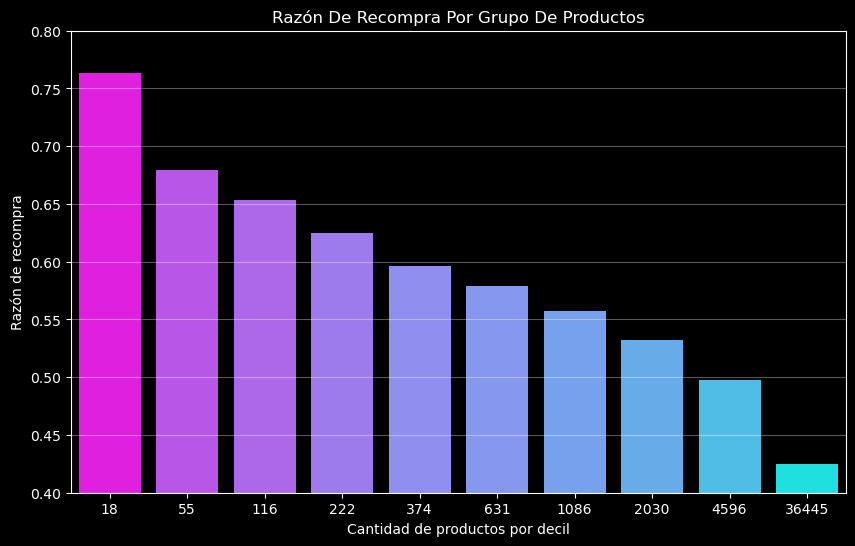
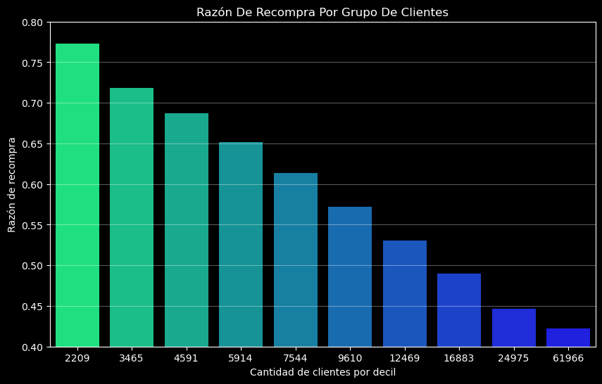
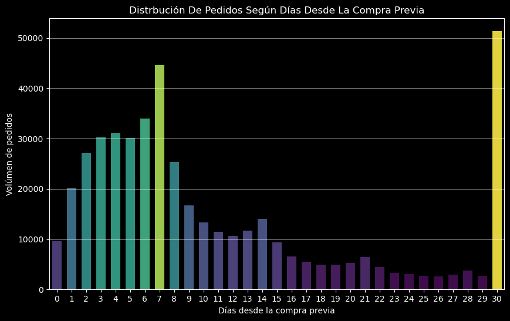

# 🛒 Inteligencia de Consumo y Optimización de Canasta en Instacart
> **Enfoque del Rol:** Data Scientist / Analytics Engineer

[](https://8lyyid3uaf6wn9a3cfxtev.streamlit.app/)
[](https://github.com/DavidVaAc/instacart-market-basket-analysis/blob/main/notebooks/instacart_eda_analysis.ipynb)

---

### 🎯 1. El Desafío (The Challenge)
* **¿Qué problema estaba resolviendo?** En el sector de e-grocery, gestionar catálogos masivos con decenas de miles de productos y millones de usuarios genera ineficiencias críticas en la cadena de suministro, desperdicio de presupuesto publicitario en marketing y cuellos de botella en la asignación de repartidores de última milla.

* **¿Por qué importa?** Sin una comprensión profunda de las dinámicas de consumo, las empresas de e-grocery no pueden optimizar su inventario ni personalizar sus campañas, lo que resulta en pérdidas económicas significativas y una experiencia de usuario deficiente.

* **Objetivo de negocio:** Analizar el historial transaccional de Instacart para identificar patrones de consumo, segmentar clientes y productos por deciles de volumen (Pareto) y extraer insights accionables que permitan optimizar la gestión de inventario, las campañas de marketing y la asignación de recursos logísticos.

---

### 🛠️ 2. Acceso al Proyecto

* 📊 **[Aplicación Interactiva (Streamlit)](https://8lyyid3uaf6wn9a3cfxtev.streamlit.app/)** — *Exploración visual interactiva en tiempo real filtrada por horarios, días y departamentos con gráficos en Plotly.*

* 📓 **[Notebook de Modelado (Jupyter)](https://github.com/DavidVaAc/instacart-market-basket-analysis/blob/main/notebooks/instacart_eda_analysis.ipynb)** — *Rigor analítico completo: Tratamiento avanzado de nulos, optimización de memoria RAM y segmentación por deciles.*

---

### 🔬 3. El Proceso End-to-End (The Process)

Seguí un flujo de trabajo analítico estructurado de inicio a fin para decodificar las dinámicas del ecosistema de Instacart:

#### A. Ingesta y Optimización de Infraestructura (Data Engineering)
Procesar un volumen transaccional masivo de **más de 400,000 órdenes y millones de registros** requería eficiencia a nivel de hardware:

* **Protocolo de Limpieza:** Identifiqué y separé los valores nulos funcionales (usuarios en su primer pedido histórico que no registran días desde la última orden) de potenciales fallos sistémicos.

* **Eliminación de Duplicados:** Detecté un patrón de duplicados concentrados en franjas horarias específicas, lo que indicaba errores de captura masiva. Estos registros se eliminaron para evitar sesgos en el análisis temporal.

* **Downcasting de Tipos de Datos:** Apliqué una reducción estricta de tipos de datos en memoria (ej. de `int64` a `int8`/`int16` y de tipo texto a `category`), disminuyendo el peso en RAM en más de un 60%, garantizando que el pipeline corra de forma fluida en servidores de bajo coste.

#### B. Análisis de Dinámicas Temporales (Mareas de Demanda)
Evalué las marcas de tiempo secuenciales para encontrar ventanas de oportunidad operativas:
* Descubrí una concentración bimodal extrema de demanda: los picos de órdenes ocurren estrictamente los **domingos y lunes**, concentrándose entre las **10:00 AM y 4:00 PM**.

#### C. Segmentación Estratégica (Pareto por Deciles)
Diseñé un marco algorítmico para ordenar y acumular acumulativamente tanto a clientes como a productos, dividiendo la base en deciles idénticos para analizar la elasticidad y concentración del volumen de compraventa.

---

### 📊 4. El Resultado e Impacto de Negocio (The Result)

* **Línea Base (Baseline) vs. Descubrimiento Analítico:** * *Intuición Estándar (Línea Base):* Asumir que el inventario debe distribuirse equitativamente en el catálogo y que los esfuerzos de marketing deben dividirse de manera uniforme entre toda la base de datos.

    * *Hallazgo Crítico:* Tus análisis demostraron que la regla de distribución es radicalmente asimétrica. 

    * **Efecto Pareto Extremo en Productos:** Solo el **1.7% del catálogo (productos orgánicos estrella)** genera el **50% del volumen de ventas total**. Más impresionante aún: el Decil 1 está compuesto por solo **18 productos ($0.04\%$ del catálogo)** que aseguran el primer $10\%$ de ingresos. *Significado comercial:* La cadena de suministro puede proteger el 10% de su facturación global supervisando el stock de solo 18 artículos.

    <p align="center">
  
    </p>

    * **Identificación de Clientes VIP:** El **$1.48\%$ de la base de usuarios** (Decil 1) genera el **$10\%$ del volumen transaccional total**, manteniendo una tasa de recompra extraordinaria del **$77.3\%$** en sus canastas básicas. *Significado comercial:* Perder a un solo cliente de este grupo equivale a perder el volumen de 50 usuarios promedio; este grupo debe blindarse con programas de lealtad prioritarios.

    <p align="center">
    
    </p>

    * **Ciclos de Fidelidad Siete-Días:** El análisis del parámetro `days_since_prior_order` detectó que la inercia del reabastecimiento tiene un ciclo de reloj exacto de **7 días**. *Significado comercial:* Las campañas automatizadas de incentivos o recordatorios inteligentes push de la app no deben enviarse al azar; deben activarse de forma predictiva en el **día 6** para capturar el hábito del usuario.

<p align="center">
  
</p>    

---

### 🛡️ 5. Limitaciones del Dataset

Declarar con honestidad las restricciones del entorno es una práctica indispensable para la toma de decisiones:
* **Naturaleza Transaccional Estática:** El conjunto de datos es una fotografía transversal de eventos completados. Al carecer de *clickstream* (rutas de clics dentro de la plataforma), el análisis muestra qué compró el usuario, pero no qué productos vio y rechazó (embudo de conversión ausente).

* **Ausencia de Elasticidad de Precios:** Los registros carecen de variables de precio dinámico o promociones aplicadas en el momento exacto de la orden, limitando la capacidad de evaluar si la concentración en productos orgánicos se debe a su posicionamiento o a incentivos económicos.

---

### 🛠️ 6. Tecnologías y Reproducibilidad

* **Core ML & Analytics:** Python, Pandas, NumPy, SciPy (Análisis Estadístico).
* **Visualización Dinámica:** Plotly D3 (Paletas optimizadas), Seaborn, Matplotlib.
* **Entorno & UI:** Jupyter Notebook, VS Code, Streamlit Cloud.

#### Instrucciones para reproducir el entorno local:
1. Clona este repositorio: `git clone https://github.com/DavidVaAc/instacart-market-basket-analysis.git`
2. Instala las dependencias necesarias: `pip install -r requirements.txt`
3. Lanza el dashboard local en tu navegador: `streamlit run src/app.py`

---

## 📁 Estructura del Repositorio
```
.
├── src/
│   └── app.py                 # Código de la aplicación interactiva en Streamlit
├── notebooks/
│   └── instacart_eda_analysis.ipynb # Análisis estadístico y cálculo de deciles
├── datasets/
│   └── df_orders_sample.parquet # Datos optimizados mediante downcasting columnar
├── images/                    # Visualizaciones clave exportadas del EDA
├── requirements.txt           # Dependencias aisladas del entorno virtual
└── README.md
```